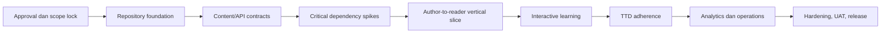

# Implementation Plan

## Interactive Digital Booklet Learning Platform

| Metadata | Nilai |
| --- | --- |
| Status | Approved for execution |
| Tanggal persetujuan | 30 Juli 2026 |
| Standing authorization | 6 Agustus 2026 |
| Dasar produk | PRD v2.1 |
| Strategi delivery | Contract-first, vertical slice, dependency-gated |
| Unit eksekusi | Satu task pada satu package/app boundary |
| Estimasi kalender | Belum ditetapkan; kapasitas tim dan deadline belum tersedia |

## 1. Keputusan Kesiapan

Blueprint produk, arsitektur, keputusan GOV-002/GOV-003, dan repository
foundation telah disetujui. Standing authorization Product Owner mengizinkan
eksekusi roadmap MVP menurut urutan dependency dalam `TASKS.md` tanpa checkpoint
persetujuan rutin.

Library kritis tetap tidak boleh dikunci sebelum spike, dependency/license
review, compatibility proof, dan contract test terkait lulus. Kondisi toolchain,
infrastruktur, task closure, serta hasil command aktual tidak diduplikasi di
dokumen ini; bukti canonical berada di `FOUNDATION-VERIFICATION.md`.

## 2. Sources of Truth

Urutan sumber yang mengikat:

1. [PRD](./PRD.md), khususnya FR-01–FR-12, NFR, delivery phase, dan MVP DoD;
2. [System Architecture](./ARCHITECTURE.md), khususnya package boundary,
   publishing transaction, editor-to-reader pipeline, dan testing strategy;
3. [Technical Ecosystem Matching](./TECHNICAL-ECOSYSTEM-MATCHING.md), khususnya
   Module 1–17, dependency gate, dan Spike A–E;
4. [Monorepo Bootstrap](./MONOREPO-BOOTSTRAP.md), khususnya urutan Step A–D;
5. [Third-Party License Register](../THIRD_PARTY_LICENSES.md);
6. [Agent Rules](../AGENTS.md).

Jika sumber konflik, pekerjaan berhenti pada boundary terkait sampai ADR atau
keputusan Product Owner menyelesaikannya.

## 3. Documentation Discovery dan Allowed APIs

API berikut telah ditemukan pada dokumentasi resmi/berotoritas. Daftar ini
adalah batas awal untuk spike, bukan izin memasang dependency tanpa license gate.

| Area | API/pola yang diizinkan | Sumber | Guard |
| --- | --- | --- | --- |
| React 19 | `createRoot`, `StrictMode`, effect cleanup, state lokal | React `/react/react/v19.2.7` | Effect hanya untuk sinkronisasi eksternal; memoization harus beralasan |
| NestJS | module/controller/provider, built-in `ValidationPipe`, `APP_PIPE`, DTO decorators | NestJS `content/pipes.md` dan `content/techniques/validation.md` | Jangan menyalin custom pipe contoh yang memakai `any`; business rule tidak berada di controller |
| Prisma | PostgreSQL datasource, generated client, migration, `$transaction` | Prisma `/prisma/prisma/7.6.0` | Akses hanya melalui `packages/database`; publish memakai transaction |
| Turborepo | `tasks`, `dependsOn`, declared `outputs`, non-cached persistent `dev` | Turborepo repository docs | Task yang menghasilkan file wajib mendeklarasikan output |
| StPageFlip | `PageFlip`, `loadFromHTML`, `on`/`off`, `getCurrentPageIndex`, `getOrientation`, `destroy` | StPageFlip class API | Dokumentasi memiliki signature lemah yang tidak konsisten; installed typings dan contract spike menjadi authority |
| Motion | import dari `motion/react`, `AnimatePresence`, `LazyMotion`, `useReducedMotion` | Motion React docs | Gunakan feature bundle terkecil; tidak boleh menjadi sumber business state |

API yang belum diverifikasi pada task tertentu harus dicari ulang dari
dokumentasi resmi pada awal task. Tidak boleh mengarang method, parameter, atau
signature berdasarkan ingatan.

## 4. Critical Path

Reminder, analytics, video, dan quiz tidak dimulai sebelum vertical slice
`author → validate → publish snapshot → read → resume` lulus.

## 5. Delivery Phases

### Phase 0A — Governance dan Repository Foundation

**Outcome**

Repository reproducible dengan pnpm workspace, Turborepo, strict TypeScript,
shared lint/format config, CI dasar, dan local infrastructure plan.

**Implement**

- jalankan task `GOV-*` dan `FND-*` pada [Tasks](./TASKS.md);
- verifikasi Git, Node/Corepack/pnpm, dan pilihan runtime LTS;
- sediakan root workspace tanpa source code fitur;
- sediakan PostgreSQL dan MinIO development setelah Docker tersedia;
- buat ADR awal dan dependency/license verification record.

**Documentation references**

- `MONOREPO-BOOTSTRAP.md` §2–§15;
- `AGENTS.md` §2–§4, §12–§15;
- `ARCHITECTURE.md` §1–§5 dan §14–§16.

**Exit criteria**

- hanya satu lockfile dan tidak ada nested workspace/git;
- install frozen-lockfile, format, lint, strict typecheck, dan empty test pipeline
  hijau;
- CI menjalankan gate yang sama;
- tidak ada `any`, `.env`, secret, atau functional placeholder;
- dependency dan license register cocok dengan lockfile;
- baseline dokumen berstatus approved.

**Anti-pattern guards**

- jangan scaffold seluruh feature sekaligus;
- jangan membuat package kosong tanpa ownership boundary;
- jangan memakai version range `latest`;
- jangan membuat folder `shared`, `common`, `helpers`, atau `utils`.

### Phase 0B — Contracts, Visual Foundation, dan Dependency Spikes

**Outcome**

Kontrak konten v1, API/error contract, database boundary, design tokens, serta
bukti kelayakan library kritis tersedia sebelum production implementation.

**Implement**

- jalankan task `CON-*` dan `SPK-*`;
- definisikan discriminated union untuk page block dan migrator fixture;
- tetapkan stable rendered page root;
- lakukan Spike A–E sesuai ecosystem matching;
- rekam keputusan flip engine, editor, upload, calendar, dan visual system dalam
  ADR serta license register.

**Documentation references**

- `PRD.md` §10–§12 dan §17;
- `ARCHITECTURE.md` §6–§13;
- `TECHNICAL-ECOSYSTEM-MATCHING.md` §3, §8–§12;
- `AGENTS.md` §4, §6–§8, §11–§12.

**Exit criteria**

- fixture page v1 valid, invalid fixture ditolak, unknown block menghasilkan safe
  fallback;
- schema package bebas React, NestJS, Prisma, dan browser API;
- spike memiliki reproducible test, hasil ukur, risiko, dan keputusan go/no-go;
- adapter contract menutupi create/update/events/cleanup/fallback;
- semua dependency kritis memiliki owner, license, version, dan exit strategy.

**Anti-pattern guards**

- jangan mengunci library kritis hanya karena demo terlihat baik;
- jangan bocorkan type pihak ketiga ke public contract;
- jangan simpan HTML/JavaScript executable di page JSON;
- jangan menganggap contoh dokumentasi bertipe lemah sebagai kontrak internal.

### Phase 1 — Author-to-Reader Vertical Slice

**Outcome**

Admin dapat login, membuat booklet sederhana, menyusun heading/paragraph/image,
preview, menerbitkan snapshot, dan learner dapat membaca serta melanjutkan posisi.

**Implement**

- jalankan task `VS-*`;
- buat auth admin minimum, booklet/revision/chapter/page, upload cover/image;
- gunakan satu renderer untuk preview dan reader;
- implementasikan publish transaction dan immutable revision;
- integrasikan flip adapter dengan vertical fallback;
- simpan progress menggunakan `revisionId + pageId`.

**Documentation references**

- `PRD.md` FR-01–FR-05, §7.1, §7.3, dan §11;
- `ARCHITECTURE.md` §6–§11;
- `MONOREPO-BOOTSTRAP.md` §11 Step C–D.

**Exit criteria**

- journey admin `create → preview → publish` lulus Playwright;
- draft tidak dapat dibaca publik;
- active reader tetap pada revision yang sama;
- interactive region tidak memicu flip;
- orientation mempertahankan page ID;
- keyboard, touch, reduced motion, dan vertical fallback diuji;
- 60-page fixture memenuhi budget awal tanpa lifecycle leak.

**Anti-pattern guards**

- app tidak mengimpor `page-flip` atau Prisma langsung;
- progress tidak menyimpan engine index sebagai identity;
- preview tidak memiliki renderer terpisah;
- tidak ada generic CRUD repository/service base class.

### Phase 2 — Interactive Learning

**Outcome**

Learner dapat menonton video, membuka mitos/fakta, mengerjakan quiz kontekstual,
dan menyelesaikan booklet dengan progress yang konsisten.

**Implement**

- jalankan task `INT-*`;
- tambah video/materi singkat dan allowlisted embed;
- tambah myth/fact block dengan accessible disclosure;
- tambah typed quiz engine, trigger setelah reader stabil, dan server scoring;
- lengkapi idempotent page/video/quiz/booklet progress;
- mulai event ingestion untuk vocabulary analytics minimum.

**Documentation references**

- `PRD.md` FR-06–FR-08, FR-11, dan §14;
- `TECHNICAL-ECOSYSTEM-MATCHING.md` Module 7–9 dan 12–13;
- `AGENTS.md` §5–§8 dan §11.

**Exit criteria**

- journey `read → video → quiz → resume/complete` lulus Playwright;
- score dari client tidak dipercaya;
- quiz tidak muncul saat flip berjalan dan focus kembali dengan benar;
- video completion memakai ambang 90% tanpa event flood;
- unknown/failed interactive block tidak menghilangkan konten lain.

**Anti-pattern guards**

- tidak ada animation orchestration dengan random `setTimeout`;
- tidak ada autoplay bersuara;
- animation state bukan business state;
- derived progress tidak diduplikasi sebagai component state.

### Phase 3 — Authenticated TTD Adherence

**Outcome**

Learner login dapat mengatur reminder, memahami keterbatasan browser notification,
mencatat status, dan melihat kalender, streak, serta adherence yang timezone-safe.

**Implement**

- jalankan task `TTD-*`;
- perluas auth untuk learner;
- model schedule, occurrence, deduplication, dan local date;
- gunakan recurrence/date/calendar library yang telah lulus spike;
- implementasikan browser permission UX dan in-app fallback;
- implementasikan log `TAKEN`, `MISSED`, `SKIPPED` serta calendar summary.

**Documentation references**

- `PRD.md` FR-09–FR-10 dan §7.2;
- `ARCHITECTURE.md` §11–§12;
- `TECHNICAL-ECOSYSTEM-MATCHING.md` Module 10–11 dan 16.

**Exit criteria**

- Bangkok/Jakarta dan minimal satu DST timezone fixture lulus;
- satu schedule/local-date tidak menghasilkan occurrence aktif ganda;
- permission `default`, `granted`, dan `denied` mempunyai UX eksplisit;
- calendar tetap berfungsi saat notification ditolak;
- formula adherence konsisten antara domain, API, dan UI;
- critical adherence journey lulus Playwright.

**Anti-pattern guards**

- tidak membuat recurrence, Gregorian calendar, atau leap-year logic sendiri;
- tidak menjanjikan delivery saat browser tertutup;
- tidak memakai client timer sebagai sumber kebenaran occurrence;
- data kesehatan personal tidak masuk log umum.

### Phase 4 — Analytics dan Admin Completion

**Outcome**

Admin melihat metrik yang didefinisikan dengan jelas tanpa mengekspos data
kesehatan personal, dan operasi konten utama memiliki audit trail.

**Implement**

- jalankan task `ANA-*`;
- finalkan validated analytics event ingestion;
- buat server-side aggregate/query dengan date range dan timezone eksplisit;
- tampilkan charts melalui wrapper Recharts beserta text summary;
- lengkapi audit event, empty/error/partial states, dan data retention policy.

**Documentation references**

- `PRD.md` FR-12, §12 Privacy/Observability, §13–§14;
- `TECHNICAL-ECOSYSTEM-MATCHING.md` Module 2, 14, dan 17;
- `AGENTS.md` §7, §9–§10.

**Exit criteria**

- definisi tiap metrik tersedia dan diuji;
- aggregation tidak dilakukan pada dataset besar di browser;
- chart accessible, memiliki labels dan text summary;
- tidak ada raw health record pada analytics umum;
- date range, timezone, empty, partial, dan error state lulus test.

**Anti-pattern guards**

- tidak membuat chart dari static div bars atau hard-coded SVG;
- tidak memperkenalkan search penuh atau notification history tanpa scope approval;
- tidak memasukkan Bklit Studio atau source premium.

### Phase 5 — Hardening, Operations, UAT, dan Release

**Outcome**

MVP memenuhi Definition of Done produk, dapat di-deploy/rollback, dan telah diuji
dengan konten anemia/TTD.

**Implement**

- jalankan task `REL-*`;
- audit WCAG 2.2 AA, performance budget, security, privacy, dan dependency;
- siapkan observability, backup/restore, deployment, rollback, dan incident notes;
- jalankan seluruh critical E2E serta UAT;
- tutup hanya defect yang menghalangi MVP DoD; defer scope tambahan secara eksplisit.

**Documentation references**

- `PRD.md` §12–§17;
- `ARCHITECTURE.md` §13–§16;
- `AGENTS.md` §9–§14.

**Exit criteria**

- seluruh MVP acceptance criteria prioritas lulus;
- tidak ada open high-severity security finding;
- LCP/INP/bundle/reader fixture memenuhi budget atau memiliki approved ADR;
- backup dan restore benar-benar direhearsal;
- deployment dan rollback terbukti;
- Product Owner menandatangani UAT anemia/TTD.

**Anti-pattern guards**

- tidak mengubah budget agar test terlihat hijau tanpa ADR dan pengukuran;
- tidak menurunkan test atau accessibility requirement;
- tidak menambah fitur non-goal menjelang release;
- tidak menyatakan siap produksi tanpa bukti restore dan rollback.

## 6. Definition of Ready untuk Setiap Task

Task boleh masuk `IN PROGRESS` jika:

- requirement dan acceptance criteria jelas;
- owning app/package tunggal telah ditentukan;
- dependency task selesai;
- dokumentasi API resmi sudah ditemukan;
- dependency baru telah melewati acceptance/license gate;
- fixture/test strategy telah ditentukan;
- tidak ada konflik source of truth yang terbuka.

## 7. Definition of Done untuk Setiap Task

Task selesai jika:

- perubahan terkecil yang koheren telah dibuat pada boundary yang benar;
- public contract typed dan tidak mengandung `any`;
- behavior, failure state, accessibility, dan cleanup yang relevan diuji;
- format, lint zero-warning, strict typecheck, tests, dan build terkait lulus;
- lockfile/license register diperbarui bila dependency berubah;
- hasil command aktual dicatat;
- dokumentasi keputusan diperbarui hanya bila contract/decision berubah.

## 8. Verification Matrix

| Change | Bukti minimum |
| --- | --- |
| Schema/domain | Unit test + valid/invalid/versioned fixtures |
| React component | Interaction + accessibility component test |
| API use case | Integration test; PostgreSQL nyata bila persistence relevan |
| Third-party adapter | Contract test terhadap versi library yang dikunci |
| Critical journey | Playwright pada breakpoint/input mode terkait |
| Dependency change | Version/peer/license/advisory verification + lockfile |
| Performance change | Before/after measurement terhadap budget |
| Security/privacy change | Abuse/failure-path test dan log-data review |

Final verification menjalankan frozen install, format check, lint, strict
typecheck, unit/component/integration tests, affected builds, critical E2E,
dependency/license audit, dan pemeriksaan pola terlarang.

## 9. Execution Protocol

1. Eksekusi mengikuti urutan dependency pada `TASKS.md`.
2. Satu sesi kerja mengambil satu task atau satu batch task pada boundary yang sama.
3. Awal sesi membaca sources yang tercantum pada phase/task.
4. API pihak ketiga dicopy dari dokumentasi yang diverifikasi, bukan diciptakan.
5. Akhir sesi melaporkan file berubah, keputusan, test yang dijalankan, hasil,
   dan blocker.
6. Task downstream tidak dimulai bila exit criteria phase sebelumnya gagal.

## 10. Keputusan Product Owner dan Standing Authorization

GOV-002 dan GOV-003 telah menyelesaikan keputusan baseline:

- password reset/account recovery, full-text search, persisted notification
  history, PDF, dan dark mode berada di luar MVP;
- filter kategori, due-reminder dashboard, vertical reader, dan tema terang
  berbasis design token tetap termasuk MVP;
- deployment memakai static Vite web/admin, containerized NestJS API, managed
  PostgreSQL, dan provider S3-compatible yang direview sebelum release;
- observability memakai provider-neutral typed boundary sekarang; vendor error
  tracking dipilih sebelum production;
- retention engineering baseline dan production legal/privacy review gate berada
  di `PRODUCT-DECISIONS.md`;
- API memakai REST JSON `/api/v1`, OpenAPI yang dihasilkan NestJS, dan generated
  frontend contracts sesuai ADR-009;
- ADR-001 sampai ADR-009 berstatus accepted. ADR-008 tetap merupakan exception
  MinIO development lokal yang sempit, bukan approval production.

Standing authorization mengizinkan task MVP dependency-ordered dilanjutkan
tanpa meminta approval rutin. Otorisasi ini tidak menghapus architecture,
security, privacy, dependency/license, quality, data-retention, dan
production-action gates. Credential eksternal, tindakan production, konflik
source of truth, risiko material baru, atau perluasan scope di luar MVP tetap
harus dihentikan pada boundary terkait sampai prasyaratnya dipenuhi.

Fitur deferred hanya dapat masuk MVP melalui perubahan PRD/decision log dengan
acceptance criteria, owner, privacy/security impact, dependency review, dan
verification plan yang eksplisit.
